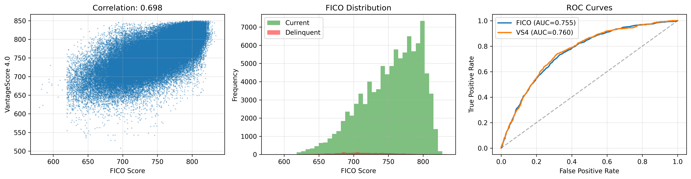

# Credit Score Comparison Pipeline

**Author:** Isaac Vergara  
**Institution:** Duke University - MSc Data Science (Quantitative Finance)  
**Courses:** IDS706 (Data Engineering) & MATH 789 (Fundamentals of Finance Business Models for Students in Math and Data Science)  

---

## Overview

Data pipeline comparing **VantageScore 4.0** vs **FICO** for predicting mortgage loan delinquency using Fannie Mae CIRT data.

**Key Technologies:** Apache Airflow, PySpark, PostgreSQL, Docker, scikit-learn

---

## Project Structure

```
IDS706_AIRFLOW/
├── dags/                          # Airflow DAGs
├── scripts/                       # Pipeline modules
│   ├── ingestion/                # Download functions
│   ├── transformation/           # PySpark merge
│   ├── loading/                  # PostgreSQL upload
│   ├── modeling/                 # ML analysis
│   └── utils/                    # Utilities
├── data/
│   ├── raw/                      # Downloaded data
│   ├── final/                    # merged_data.parquet
│   └── outputs/
│       ├── models/               # .pkl models
│       └── visualizations/       # .png plots
├── sql/                          # Database scripts
├── config/                       # Configuration
├── .env                          # Environment variables
├── docker-compose.yml            # Services
├── Dockerfile                    # Custom image
└── requirements.txt              # Dependencies
```

---

## Quick Start

```bash
# 1. Set Airflow UID
echo "AIRFLOW_UID=$(id -u)" >> .env

# 2. Build and start
docker-compose up -d --build

# 3. Access Airflow
# http://localhost:8080 (airflow/airflow)

# 4. Trigger DAG: pyspark_cirt_vantagescore_merge
```

---

## Pipeline Workflow

```
Download CIRT → PySpark Merge → Upload PostgreSQL → Analyze & Model → Cleanup


```



### Tasks
1. **Download CIRT** - Fannie Mae API (~1.5GB)
2. **PySpark Merge** - Distributed processing with VantageScore data ⭐
3. **Upload PostgreSQL** - Store merged dataset
4. **Analyze** - Logistic regression, ROC curves, visualizations
5. **Cleanup** - Remove intermediate files

---

## Analysis

**Dataset:** ~1.6M mortgage loans  
**Target:** Binary delinquency (0=current, 1=delinquent)  
**Models:** Logistic regression (FICO vs VS4)  
**Evaluation:** ROC-AUC scores

**Outputs:**
- `data/outputs/models/` - Trained models (.pkl)
- `data/outputs/visualizations/` - Correlation, distributions, ROC curves (.png)
- PostgreSQL table: `cirt_vantagescore_merged`


## Credit Score Comparison: FICO vs. VantageScore 4.0

This analysis evaluates the relationship and predictive performance of two credit scoring models—FICO and VantageScore 4.0 (VS4)—using a sample of consumer credit data.

### 1. Score Correlation

- The scatter plot shows a moderately strong positive correlation between FICO and VS4 scores, with a Pearson coefficient of 0.698.
- While the scores generally move together, the correlation below 0.70 indicates that the models are not interchangeable. Differences in score calculation methodologies likely contribute to divergence, particularly at the tails.

### 2. FICO Score Distribution by Delinquency Status

- The histogram reveals that most individuals have FICO scores between 650 and 800.
- Delinquent borrowers are concentrated in the lower score ranges, while current borrowers dominate the higher end.
- This separation suggests that FICO scores are directionally informative for credit risk, though not necessarily optimal for classification.

### 3. Predictive Performance (ROC Curves)

- Receiver Operating Characteristic (ROC) curves compare the ability of each score to distinguish between current and delinquent accounts.
- Area Under the Curve (AUC) values:
  - FICO: 0.735
  - VS4: 0.760
- VS4 demonstrates slightly better classification performance, implying it may capture more nuanced risk signals or benefit from updated modeling techniques.

### Summary

- FICO and VS4 scores are positively correlated but differ in granularity and predictive power.
- Both scores show meaningful separation between risk groups, with VS4 offering marginally stronger performance in distinguishing delinquency.
- These findings support the use of VS4 as a viable alternative or complement to FICO in credit risk modeling.

---

## Tech Stack

| Component | Technology |
|-----------|-----------|
| Orchestration | Apache Airflow 2.8.1 |
| Big Data | PySpark 3.5.0 ⭐ |
| Database | PostgreSQL 15 |
| ML | scikit-learn, pandas |
| Container | Docker |

---

## Academic Context

### IDS706 - Data Engineering
- Production data pipelines with Airflow
- Distributed processing with PySpark (Super Bonus)
- ETL workflow orchestration
- Database integration

### MATH 789 - Fundamentals of Finance Business Models for Students in Math and Data Science
- Binary classification for credit risk
- Logistic regression modeling
- ROC-AUC evaluation
- Model comparison analysis

---

## Configuration

Key environment variables in `.env`:
```properties
BASE_64_AUTH=<fannie_mae_credentials>
POSTGRES_USER=airflow
POSTGRES_PASSWORD=airflow
RAW_DATA_DIR=/opt/airflow/data/raw
```

---

## Troubleshooting

**Out of Memory:** Increase Docker RAM to 8GB+  
**PySpark Error:** Rebuild with `docker-compose build --no-cache`  
**DB Connection:** Check `docker-compose logs postgres`  

---

## Author

**Isaac Vergara**  
📧 isaacvergaram@hotmail.com  
🔗 [LinkedIn](https://linkedin.com/in/isaac-vergara) | [GitHub](https://github.com/isaacvm98)

---

**Last Updated:** November 2, 2025